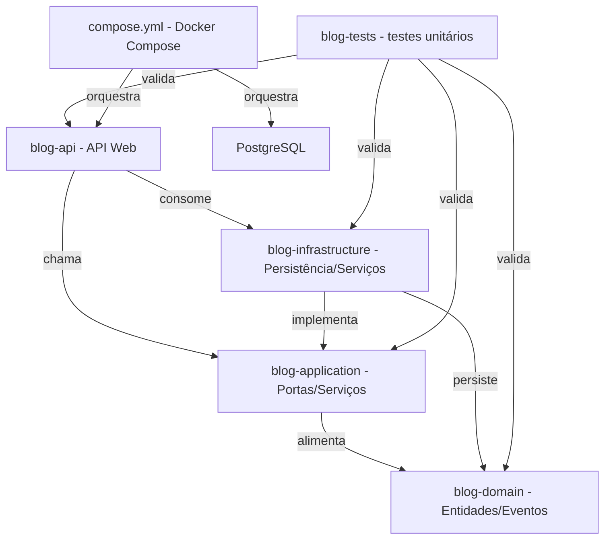

# Blog Portfolio

Esta solução demonstra um blog construído com .NET 10 seguindo arquitetura em camadas (API → Aplicação → Domínio → Infraestrutura), com persistência PostgreSQL e uma estratégia ampla de testes automatizados. O desenvolvimento funcionou como uma experiência de pair programming com ferramentas de IA, onde as instruções e correções manuais guiaram o fluxo enquanto a IA sugeria trechos, explicações e ajustes sutis.
O foco em TDD manteve o ritmo: partimos pelos testes clássicos de domínio (modelo Detroit), depois criamos cenários de aplicação mais amplos e, finalmente, incorporamos testes integrados e E2E para assegurar que a API entregue o comportamento esperado do início ao fim.

## Visão geral
- `blog-api` expõe os endpoints REST (Autenticação, Posts, etc.) e injeta dependências da aplicação e infraestrutura.
- `blog-application` define contratos, DTOs e serviços que implementam regras de caso de uso usando portas (interfaces) compartilhadas com o domínio.
- `blog-domain` agrupa entidades, eventos de domínio e primitivas essenciais.
- `blog-infrastructure` contém implementações de persistência (EF Core), hashing de senha, message bus de console e migrações SQL.
- `blog-tests` reúne testes de unidade para as camadas de aplicação, domínio e infraestrutura.

## Tecnologias principais
- ASP.NET Core 10 com controllers, Swagger e migrações automáticas ao subir a API.
- Entity Framework Core + Npgsql para persistência em PostgreSQL.
- Modelo de mensagem simples (`ConsoleMessageBus`) para eventos.
- Docker Compose (`compose.yml`) orquestrando PostgreSQL 15 e o watcher da API.

## Configuração
1. Instale o **.NET 10 SDK** e tenha um PostgreSQL acessível (local ou via Docker). A conexão padrão é `Host=localhost;Database=blog;Username=blogadmin;Password=blogsecret`.
2. A string pode ser substituída por:
   - variável de ambiente `BLOG_DATABASE_CONNECTION`
   - `ConnectionStrings:BlogDatabase` em `appsettings.json`
3. Durante o startup, a API aplica migrações automaticamente via `IDatabaseMigrationService`.

## Execução
### Sem Docker
```
dotnet build
dotnet run
```
A API irá expor `https://localhost:{porta}` e, em ambiente de desenvolvimento, habilita Swagger.

### Com Docker Compose
```
docker compose -f compose.yml up --build
```
O serviço `blog-api` usa `dotnet watch run` e se conecta ao PostgreSQL `db` (porta 5432). Ajuste `BLOG_DATABASE_CONNECTION` no `compose.yml` se necessário.

## Testes
```
dotnet test
```

## Observações
- O backend aplica migrações automaticamente ao iniciar, mas o arquivo `Migrations` no projeto `blog-infrastructure` também pode ser gerenciado via `dotnet ef`.
- Swagger fica ativo apenas em `Development`; use `https://localhost:<porta>/swagger` para explorar os endpoints de autenticação e blog.

## Propósito pessoal
Este projeto servirá como portfólio e blog: postarei periodicamente reflexões sobre estudos, experimentos e aprendizados para mostrar a evolução técnica (arquitetura limpa, containers, testes) e o cuidado em documentar e ensinar o que aprendi.

## Metas
### Infraestrutura e backend
- [x] Criar a base em camadas (.NET 10) com projetos separados para API, Aplicação, Domínio e Infraestrutura
- [x] Habilitar migrações EF Core ao subir o serviço via `IDatabaseMigrationService`
- [ ] Implementar os controllers e expor os endpoints REST desejados
- [ ] Desenvolver o frontend/acesso via browser

### Qualidade e testes
- [x] Testes de unidade cobrindo domínio, aplicação e infraestrutura
- [ ] Implementar testes de integração para validar o comportamento combinado das camadas
- [ ] Implementar testes E2E para garantir o fluxo completo da API

### Experiência pessoal e documentação
- [x] Documentar o propósito, tecnologias e arquitetura do projeto no README
- [x] Manter um blog/portfólio com postagens periódicas sobre estudos e aprendizados
- [ ] Publicar novas postagens guiando-se pelos temas estudados (TDD, segurança, containers etc.)

## Implementado até agora
- `blog-api` com configuração de dependências, Swagger e migração automática
- `blog-application`, `blog-domain` e `blog-infrastructure` organizados para implementar casos de uso e persistência
- Infraestrutura com hashing de senha, message bus e migrações EF Core
- Suite de testes de unidade focada em domínio, aplicação e infraestrutura
- Documentação em `README.md` com visão geral, propósito e diagrama Mermaid das relações

## Referências inspiradoras
- *Unit Testing Principles, Practices, and Patterns* — Vladimir Khorikov
- *Secure by Design* — Dan Bergh Johnsson, Daniel Deogun e colaboradores
- *Test Driven Development: By Example* — Kent Beck
- Canal no YouTube [**MilanJovanovicTech**](https://www.youtube.com/c/MilanJovanovicTech) para aprendizado de C# e do framework .NET

## Arquitetura dos projetos
O diagrama abaixo descreve como os projetos .NET se relacionam e de onde vêm as dependências.


